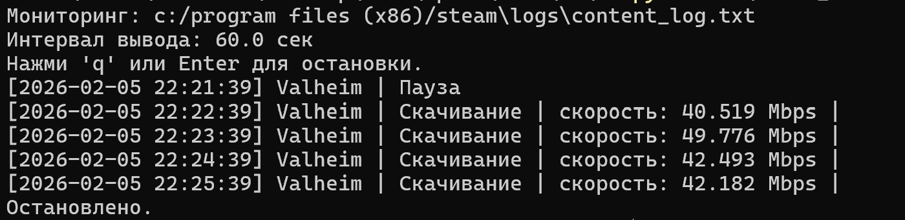

# Фоновое отслеживание скорости загрузки игр Steam

## Запуск приложения

Из корня проекта:

```bash
python3 steam_download_monitor.py
```

Можно добавить ключ -i и после него число:

```bash
python3 steam_download_monitor.py -i 5
```

Таким образом, информация будет выводиться каждые 5 секунд.


## Пример работы



- Выводится расположение файла с логами Steam;
- Выводится интервал, с которым будет появляться информация о загрузке;
- Выводится вспомогательная информация о том, как заранее прекратить работу приложения (приложение автоматически завершает работу спустя 5 минут);
- Выводится информация о загрузке;
  - Текущее время;
  - Название игры (если какая-то игра загружается);
  - Статус;
  - Скорость загрузки.
